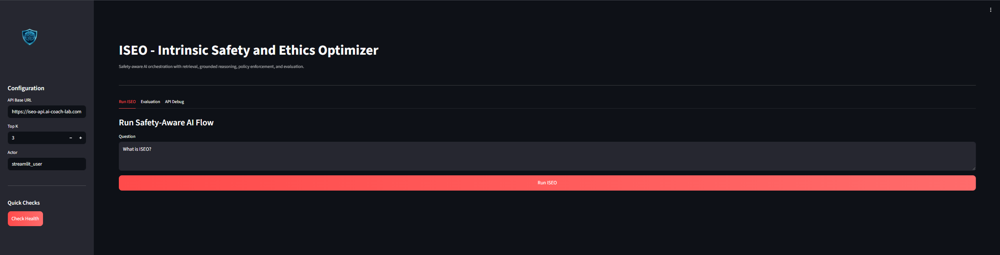
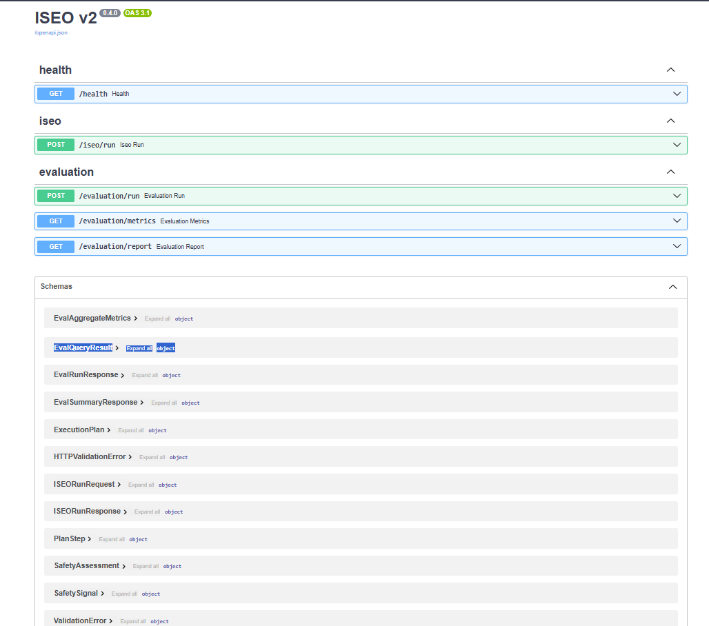
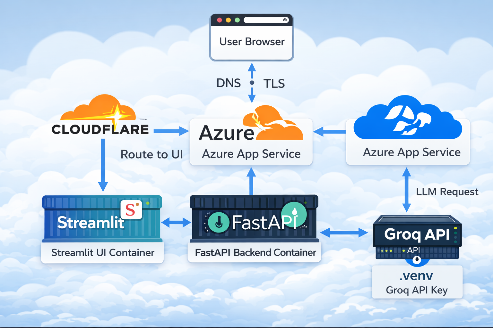

# 🛡️ ISEO – Intrinsic Safety & Ethics Optimizer

<p align="center">
  <a href="https://iseo.ai-coach-lab.com">
    
  </a>
  <a href="https://iseo-api.ai-coach-lab.com/docs">
    
  </a>
  
  
  
  
  
  
</p>

> ISEO is a **safety-first AI orchestration system** that evaluates user prompts, applies policy-aware reasoning, and ensures responsible AI outputs through structured execution pipelines.

## 🌐 Live System

- **UI:** https://crb-iseo.streamlit.app  
- **API Base:** https://iseo-api.ai-coach-lab.com  
- **API Docs (Swagger):** https://iseo-api.ai-coach-lab.com/docs  
- **Health Check:** https://iseo-api.ai-coach-lab.com/health

## 📌 Overview

ISEO is designed as a **defensive AI system** that:

- Analyzes user input for risk signals  
- Applies policy-aware decision logic  
- Routes execution through a controlled AI pipeline  
- Produces safe, explainable outputs  

## 📸 Screenshots

### UI Dashboard


### API Documentation


## 🏗 Architecture Diagram



## 💡 Why This Project Matters

ISEO focuses on **AI safety and decision control**, which is critical as AI systems move into real-world applications.

This project demonstrates how to:

- Add guardrails to LLMs  
- Build safe AI pipelines  
- Control outputs in production environments  
- Apply structured reasoning before generation  

## 🧠 Core Capabilities

| Capability | Description |
|----------|------------|
| 🛡 Safety Classification | Detects cyber, privacy, and harmful intent patterns |
| 📊 Risk Scoring | Assigns structured risk levels (low / medium / high) |
| ⚖ Decision Engine | Determines allow / review / block outcomes |
| 🔁 Execution Planning | Step-by-step AI workflow generation |
| 📎 Grounded Responses | Ensures outputs are structured and controlled |
| 📈 Evaluation Metrics | Built-in evaluation pipeline for system performance |
## ⚙️ Example Output

```json
{
  "status": "ok",
  "risk_level": "low",
  "decision": "allow",
  "answer": "I am ISEO, an Intrinsic Safety & Ethics Optimizer."
}
